# Utiliser le gestionnaire de fichiers d’Ubuntu

Niveau débutant – Ubuntu 20.04 et suivants

« Gnome Fichiers » est le gestionnaire de fichiers utilisé par Ubuntu et les distributions Linux basées sur Gnome. Il permet d’organiser vos données : rechercher, ouvrir, copier, déplacer, compresser ou supprimer des fichiers. Il permet la prévisualisation de certains médias (images, fichiers PDF,…) sans avoir à lancer un programme spécial.

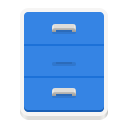

<!-- 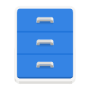 -->

Bien utiliser les fonctions de base du gestionnaire de fichier permet de classer ses données dans une arborescence de dossiers permettant de retrouver rapidement ses fichiers et de gagner du temps. Une organisation efficace des documents numériques permet également de limiter l’utilisation de documents papier dans les archives.

## Table des matières

[[_TOC_]]

Ce document créé par Vivien Guéant est publié sous la licence Creative Commons BY-SA 4.0 (partage dans les mêmes conditions). Vous pouvez donc le diffuser, le modifier et le redistribuer. Suggestions : Forum LaFibre.info

Version du 29 décembre 2021. Lien vers la dernière version : format PDF <https://lafibre.info/testdebit/ubuntu/tutoriel_ubuntu_fichiers.pdf> – format LibreOffice ODT <https://lafibre.info/testdebit/ubuntu/tutoriel_ubuntu_fichiers.odt>

---

## Rechercher un fichier

1. Se rendre dans le dossier où chercher le fichier ;
2. Cliquer sur le symbole « loupe » à droite et rentrer le texte à chercher.

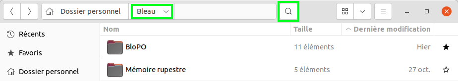

Attention : ici la recherche se fera dans le dossier « Bleau » et ses sous-dossier.

Pour chercher dans l’ensemble du « Dossier personnel », il faut au préalable cliquer sur ce dernier, avant de cliquer sur le symbole « loupe ».

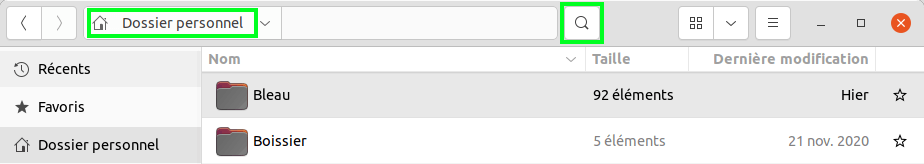

## Ouvrir le dossier où est stocké le fichier

Ci-dessous, nous avons fait une recherche. Le fichier sélectionné est dans le dossier « Poésie ».

Pour afficher rapidement ce dossier et tous les fichiers qu’il contient, cliquer avec le bouton droit de la souris sur le fichier, puis sélectionner « Ouvrir l’emplacement de l’élément ».

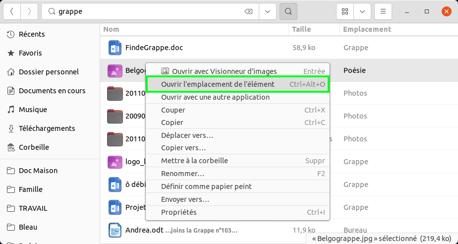

## Afficher les fichiers sous forme de liste ou de grille

Si l’affichage est sous forme de grille (c’est le cas ci-dessous), il faut cliquer sur l’icône « liste » en haut à droite :

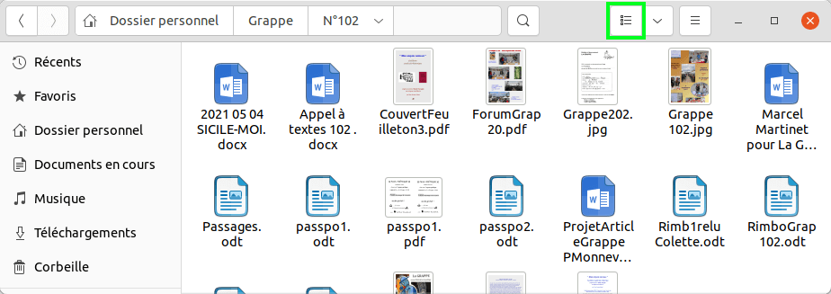

On bascule sus une liste de fichier (c’est le cas ci-dessous). On peut repasser en mode grille en cliquant sur l’icône « grille » en haut à droite :

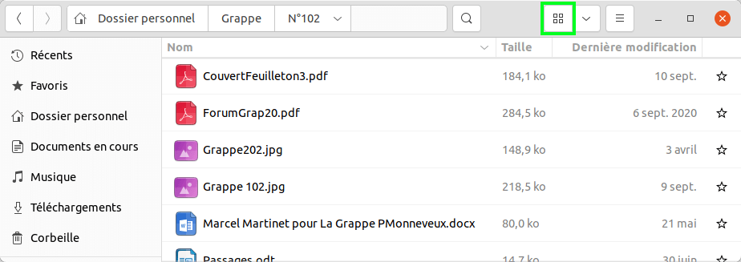

La taille des icônes est maintenant trop petite pour afficher le contenu des PDF et des images.

Il est possible d’agrandir ou réduire la taille des icônes, avec la loupe. Agrandir au maximum la taille permet de faciliter le tri des photos, car on peut identifier le contenu sans ouvrir le fichier.

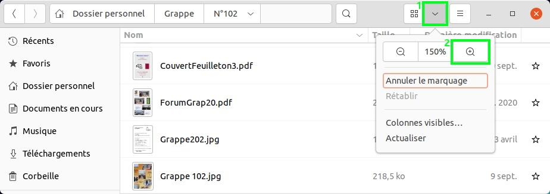

## Trier les fichiers par ordre alphabétique, taille ou date

Par défaut les fichiers d’un dossier sont triés dans l’ordre alphabétique.

Pour trier les fichiers par taille, il faut cliquer sur le mot « Taille » en haut de la liste des fichiers.
Les fichiers sont alors triés du plus petit au plus gros. Pour trier du plus grand au plus petit, il faut faire un second appui sur le mot « Taille » en haut de la liste des fichiers.

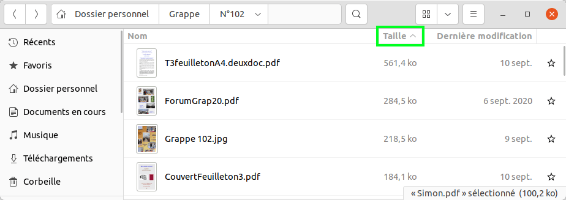

**Trier par date :**

Pour trier par date, il faut cliquer sur le mot « Dernière modification » en haut de la liste des fichiers.
Un second clic permet d’inverser l’ordre de tri.

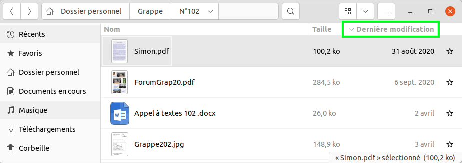

**Repasser sur l’ordre alphabétique :**

Cliquer sur le mot « Nom » en haut de la liste des fichiers pour passer en ordre alphabétique (A=>Z et Z=>A au second clic sur le mot « Nom »).

Attention : Si le dossier comporter des sous-dossiers, ils sont triés en premier avant les fichiers : Tous les sous-dossiers triés par ordre alphabétique suivit de tous les fichiers triés par ordre alphabétique.

## Mettre un dossier fréquemment utilisé en signet

Cela permet d’accéder rapidement aux dossiers que vous utilisez le plus souvent.

Il suffit de prendre le dossier avec la souris et le déplacer en bas à gauche, sous la « Corbeille », c’est l’espace pour les dossiers favoris.

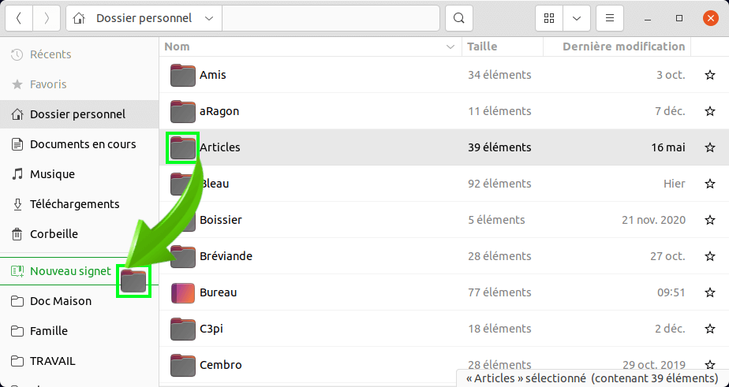

**Supprimer un signet :**

Pour supprimer un signet, il faut cliquer avec le bouton droit de la souris sur ce signet et cliquer sur « Enlever » : (les dossier n’est pas supprimé du disque, c’est juste le signet qui est supprimé)

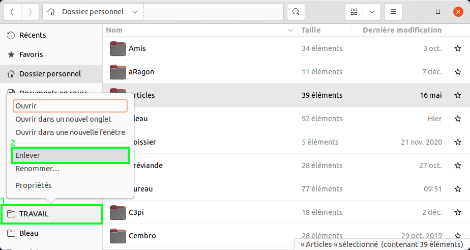

## Mettre des fichiers en favoris pour avoir un bureau net

Comment gérer tous les fichiers / dossiers en cours, sans encombrer le bureau ?

Cela passe par deux dossiers listés en haut à gauche :

* Favoris
* Téléchargements

Les fichiers qui ont vocation à être supprimés une fois traités sont placés dans le dossier « Téléchargement », le dossier où les fichiers téléchargés d’internet arrivent.

Les fichiers qui ont vocation à être gardés une fois traités sont placés dans leur dossier cible, et seront marqués comme « favoris ». Une fois le traitement fait, ils seront démarqués, ce qui est rapide à faire.

En affichage « grille », on clique sur le fichier ou dossier concerné avec le bouton droit et on clique sur « Marquer comme favori » :

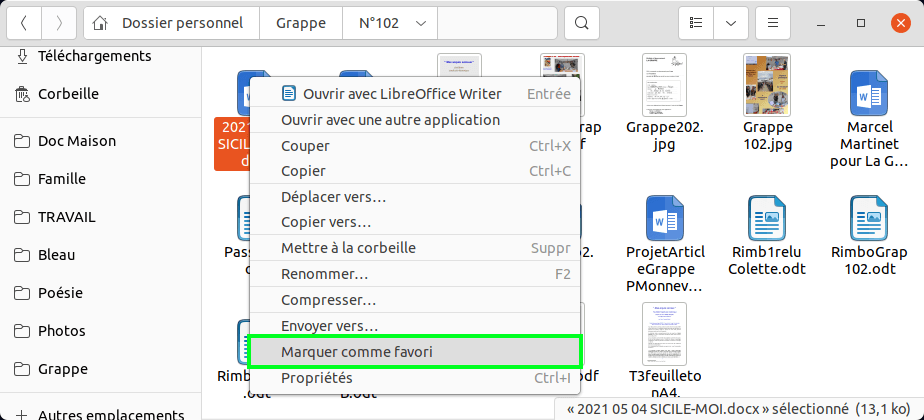

En affichage « liste », il faut cliquer sur la petite étoile située à la droite de la ligne du fichier.

Les fichiers marqués sont listés dans leur dossier d’origine et dans « Favoris ». On peut facilement « démarquer » un fichier en cliquant sur l’étoile à droite, en affichage « liste » :

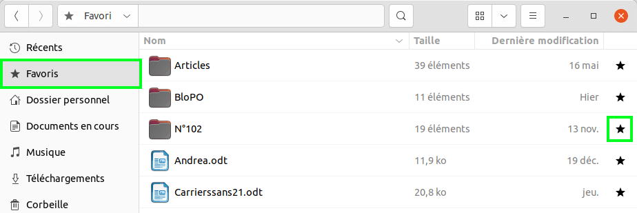

## Accéder aux fichiers récents

Les fichiers récemment créés ou modifiés sont disponibles dans le menu « Récents » tout en haut à gauche :

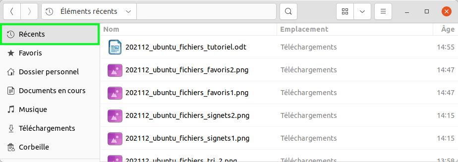

## Navigation rapide dans les dossiers

Il est possible de naviguer de multiples façon dans arborescence du disque :

* En partant du dossier personnel ;
* En partant des dossiers du volet à gauche (dossiers épinglés, favoris,…) ;
* En partant d’une recherche.

Lors de la navigation, il est possible de revenir à l’emplacement précédent avec l’icône « En arrière » située tout en haut à gauche et entourée en vert ci-dessous.

Par exemple pour se rendre au dossier « Grappe » que j’ai entouré de bleu, situé deux fois avant celui sur lequel nous sommes, il est possible de :

* Cliquer deux fois sur l’icône « en arrière » pour revenir deux fois en arrière ;
* Cliquer une fois sur « Grappe » (celui qui est entouré en bleu) pour aller directement au dossier en question.

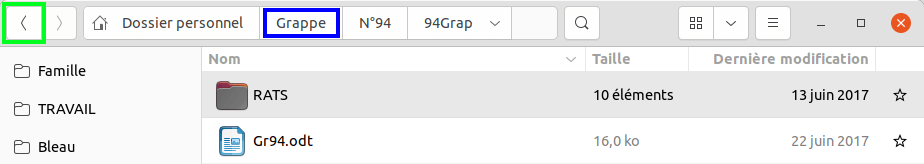

## Créer un nouveau dossier

1. Aller dans le menu latéral en haut à droite ;
2. Cliquer sur le symbole « dossier » de droite avec un petit « + ».

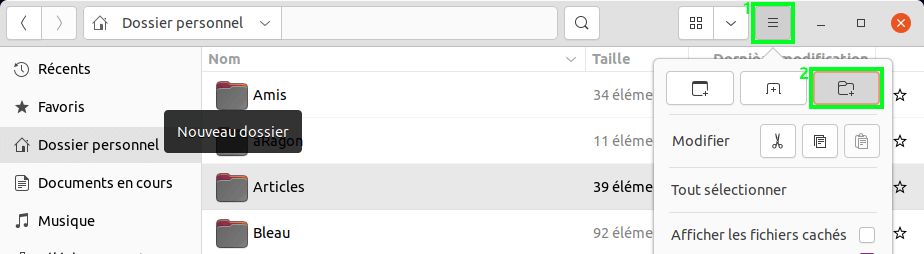

## Ouvrir un fichier avec une autre application

Pour chaque type de fichier, il y a une application par défaut. Par exemple une photo va s’ouvrir avec le visionneur d’images.
Pour ouvrir un fichier avec une autre application, par exemple une photo avec Gimp pour la retoucher, il faut cliquer avec le bouton droit sur le fichier, puis sélectionner « Ouvrir avec une autre application ».

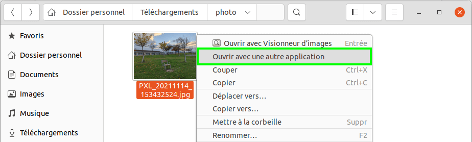

Un menu permet de choisir avec d’autres logiciels compatibles avec le type de fichier.

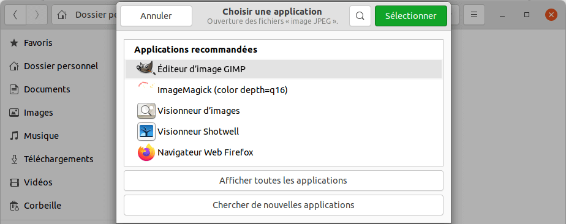

## Créer un fichier compressé (.zip)

Un fichier Zip permet de regrouper plusieurs fichiers en un seul, pour faciliter les échanges.

Par exemple si vous avez des fichiers trop volumineux pour être envoyé dans un mail, il faut les compresser dans un fichier qui sera transféré dans un outil de partage de fichier tel que WeTransfer. Cela vous permet de récupérer une URL que vous envoyez dans un mail à la place des fichiers. Le lien de partage reste disponible pendant une dizaine de jours.

1. Sélectionner les fichiers à compresser ;
2. Cliquer avec le bouton droit sur un des fichiers sélectionnés ;
3. Cliquer sur « Compresser... » ;

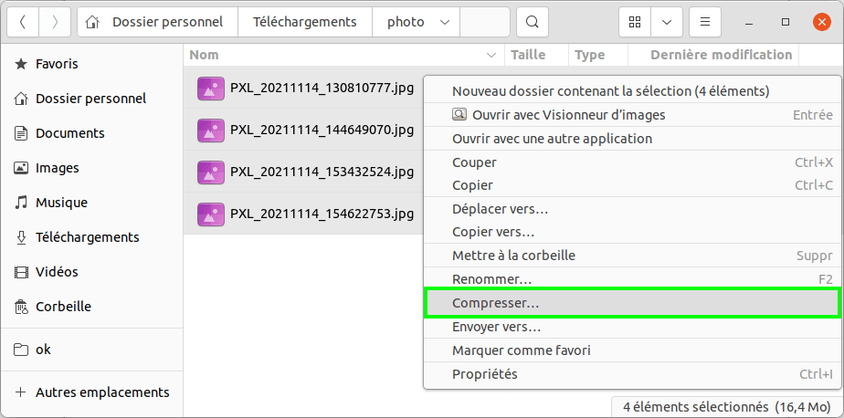

4. Indiquer le nom du fichier .zip à créer ;
5. Cliquer sur le bouton « Créer » en haut à droite.

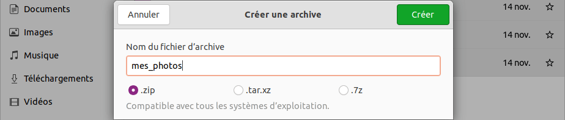

À noter que l’outil propose d’autre format que le .zip.

Le .zip n’est pas le meilleur en ratio de compression, mais il a l’avantage d’être lisible partout.

Attention : certaines entreprises bloquent les fichiers .zip dans des mails car de nombreux virus se cachent dans des fichiers .zip joint à des mails qui incident l’utilisateur à ouvrir le fichier. Si c’est le cas, vous pouvez utiliser le format « .tar.xz » si votre correspondant est sous Linux ou Mac et « .7z » si votre correspondant est sous Windows.

## Extraire les fichiers d’une archive .zip

1. Télécharger le fichier .zip que l’on vous a envoyé ;
2. Cliquer avec le bouton droit sur le fichier puis « Extraire ici ».

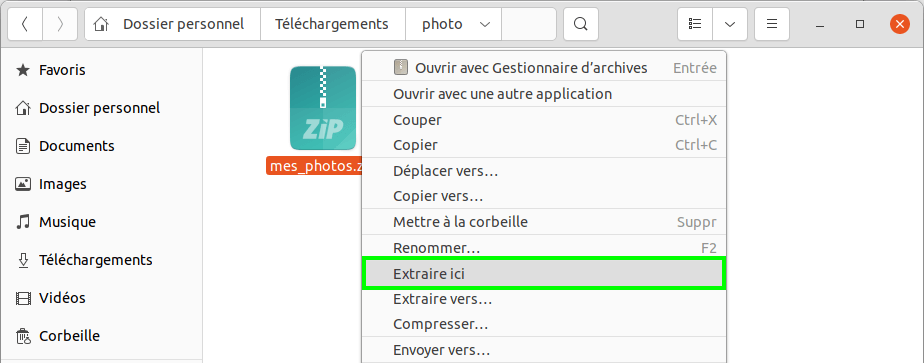

Le choix de « Extraire vers… » permet de sélectionner un autre dossier pour extraire les fichiers.

## Éjecter proprement une clé USB

Pour éjecter une clé USB, une carte SD ou un disque dur externe, il faut cliquer sur l’icône d’éjection, que j’ai entouré en vert, située à droite de la clé USB.

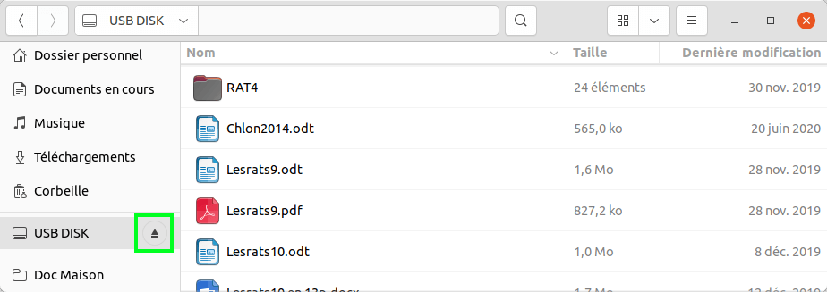

Une notification va apparaître en haut de l’écran autorisant l’éjection, demandant de patienter si des données doivent être écrites sur la clé USB ou refusant, si une application a ouvert un fichier situé sur cette clé USB (il faut donc au préalable fermer ce fichier).

En cas de difficulté pour éjecter proprement une clé USB, il y a une solution simple : éteindre ou redémarrer l’ordinateur. Avant l’extinction, la clé USB sera proprement éjectée, après avoir forcé les applications qui utilisent des fichiers à se fermer si nécessaire.

## Vérifier l’espace disque disponible

Il est possible de voir l’espace disponible en cliquant avec le bouton droit sur un espace vide de n’importe quel dossier. L’espace disponible du disque ou de la clé USB s’affiche en bas de la fenêtre de propriété :

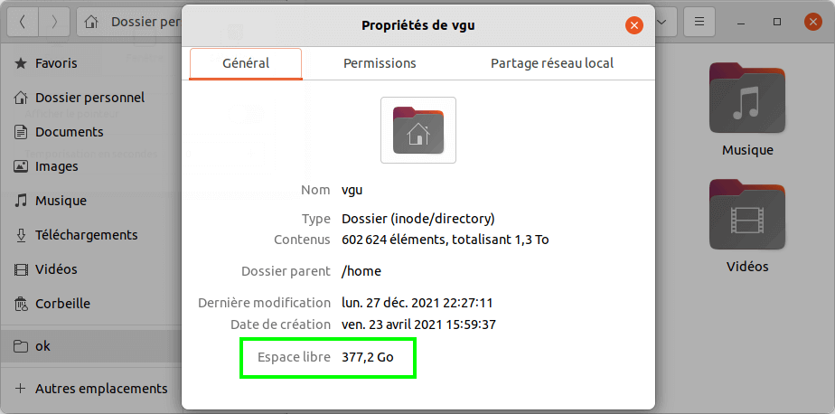

Pour comprendre dans quel dossier par l’espace disque utilisé, il y a un outil fantastique. Pour le lancer, afficher toutes les applications et taper « ana » pour filtrer les applications. Cliquer sur « Analyseur d’utilisation des disques ».

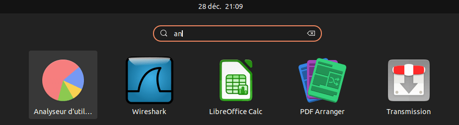<!-- width="5%" -->

L’analyseur d’utilisation des disques va vous permettre de voir quels sont les dossiers les plus gros (ici le dossier « Public » fait 1,1 To et on voit graphiquement à droite les sous-dossiers les plus volumineux :

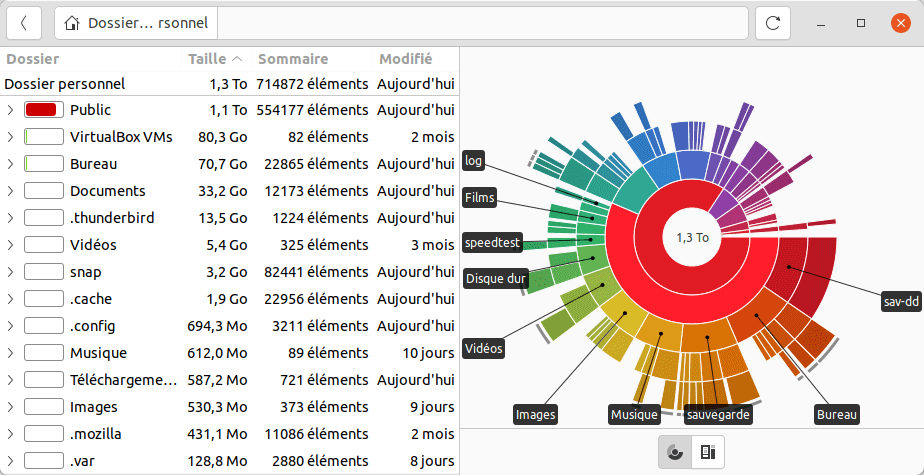

## Afficher les métadonnées des fichiers

Le gestionnaire de fichiers d’Ubuntu est en mesure de donner des métadonnées (informations) sur de nombreux médias. Il suffit de cliquer avec le bouton droit sur un fichier puis faire « Propriétés ».

Exemple avec un fichier audio et une vidéo :

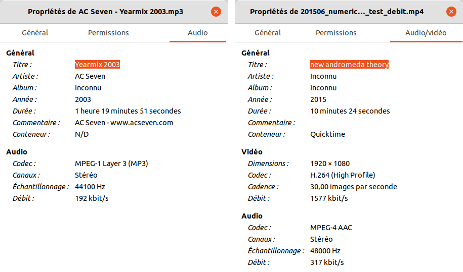

Exemple avec un fichier PDF :

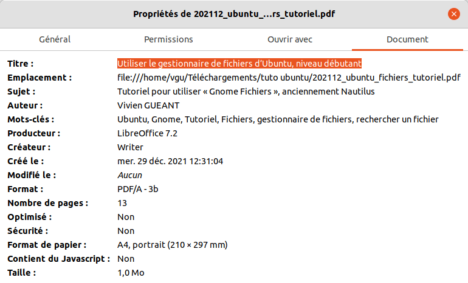

## Résoudre les blocages d’impression

Si l’imprimante n’imprime plus les documents alors qu’elle semble prête, cela peut être lié à un document, par exemple imprimé dans un format de papier non supporté par l’imprimante. Les impressions suivantes sont également bloquées car elles sont derrière dans la file d’attente.

La solution consiste souvent à supprimer tous les documents de liste des « tâches d’impression », éteindre l’imprimante et la rallumer pour vider sa mémoire cache.

**Vider la liste des « tâches d’impression actives »**

1. Il faut aller dans le menu tout en haut à droite de l’écran et cliquer sur « Paramètres » ;

<!--  !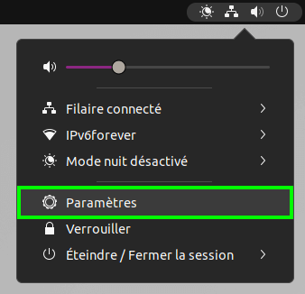 -->

2. Dans la liste à gauche, chercher imprimantes ;
3. Cliquer sur le bouton indiquant que plusieurs taches d’impressions sont actives ;
4. Cliquer sur la corbeille à droite de chaque tache ou sur le bouton « Tout effacer » en haut à gauche.

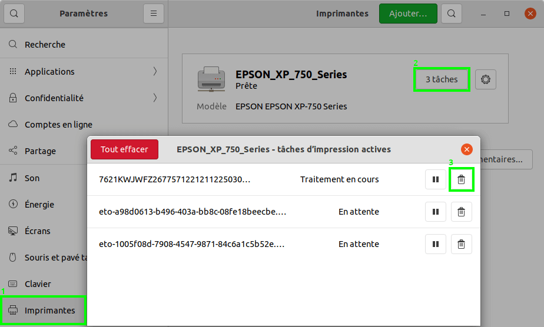
